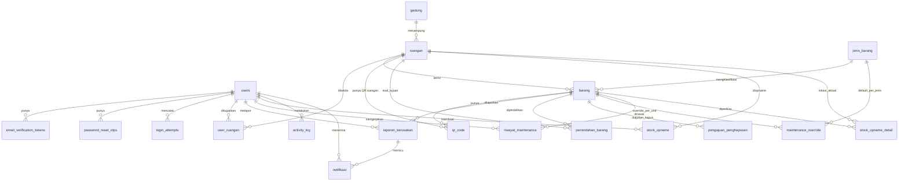

# Desain Database (Acuan ERD)

<aside>
📌

Dokumen ini menjelaskan **rancangan entitas (tabel) dan relasi** untuk Sistem Inventaris Barang Fakultas. Tujuannya sebagai **acuan pembuatan ERD** dan implementasi skema. Ini *bukan* kode final, melainkan penjelasan logis tiap tabel, kolom, tipe data konseptual, dan relasi antar tabel.

Mengacu pada PRD v1.2 (model 5 role + desentralisasi).

</aside>

## Konvensi umum

- **Primary Key (PK):** setiap tabel punya `id` bertipe **UUID** kecuali disebut lain.
- **Foreign Key (FK):** kolom relasi diberi akhiran `_id` dan menunjuk ke `id` tabel tujuan.
- **Timestamp:** sebagian besar tabel punya `created_at` dan `updated_at` (Datetime). Untuk hemat ruang, tidak selalu ditulis ulang di tiap tabel di bawah.
- **Enum:** nilai pilihan tetap ditulis di kolom keterangan dan dirangkum di bagian akhir.
- **Soft delete / arsip:** gunakan kolom status (mis. `NONAKTIF`) ketimbang menghapus baris, agar histori tetap utuh.

## Diagram relasi (ERD awal)

Diagram di bawah adalah kerangka awal. Silakan disempurnakan saat membuat ERD final.

---

# A. Autentikasi & Pengguna

## 1. `users`

Menyimpan semua akun (5 role). Satu akun = satu role (tidak rangkap).

| Kolom | Tipe | Keterangan |
| --- | --- | --- |
| id | UUID | **PK** |
| email | String | Unik, wajib domain `*.uns.ac.id` (@staff/@student/@uns) |
| password_hash | String | Hash bcrypt |
| nama_lengkap | String | Nama pengguna |
| role | Enum | `PENGGUNA`, `PJ_RUANG`, `LABORAN`, `INVENTARIS`, `PIMPINAN` |
| status | Enum | `PENDING_VERIFICATION`, `ACTIVE`, `INACTIVE` |
| email_verified_at | Datetime? | Null jika belum verifikasi email |
| created_at / updated_at | Datetime | Audit waktu |

## 2. `email_verification_tokens`

Token verifikasi email saat Sign Up (berlaku 24 jam).

| Kolom | Tipe | Keterangan |
| --- | --- | --- |
| id | UUID | **PK** |
| user_id | UUID | **FK** → `users.id` |
| token | String | Token (disimpan ter-hash) |
| expires_at | Datetime | Kedaluwarsa 24 jam |
| used_at | Datetime? | Diisi saat token dipakai |

## 3. `password_reset_otps`

OTP lupa password (6 digit, berlaku 10 menit).

| Kolom | Tipe | Keterangan |
| --- | --- | --- |
| id | UUID | **PK** |
| user_id | UUID | **FK** → `users.id` |
| otp_code | String | 6 digit (disimpan ter-hash) |
| expires_at | Datetime | Kedaluwarsa 10 menit |
| used_at | Datetime? | Diisi saat OTP dipakai |

## 4. `login_attempts`

Catatan percobaan login untuk rate limit (5 gagal → lock 5 menit).

| Kolom | Tipe | Keterangan |
| --- | --- | --- |
| id | UUID | **PK** |
| email | String | Email yang dicoba (boleh tanpa FK karena bisa email tak terdaftar) |
| ip_address | String | Alamat IP |
| success | Boolean | Berhasil / gagal |
| attempted_at | Datetime | Waktu percobaan |

---

# B. Lokasi & Penugasan

## 5a. `gedung` (entitas baru)

Master gedung. Dipisah jadi entitas tersendiri agar bisa dijadikan **FK** dari `ruangan` (dan entitas lain bila perlu).

| Kolom | Tipe | Keterangan |
| --- | --- | --- |
| id | UUID | **PK** |
| kode_gedung | String? | Kode singkat opsional, mis. `GD-A` |
| nama_gedung | String | Nama gedung, mis. `Gedung A` |

## 5. `ruangan`

Master lokasi. **Daftar ruangan FIX & dikunci**, dikelola Inventaris. Membedakan ruang kelas dan laboratorium lewat `tipe`.

| Kolom | Tipe | Keterangan |
| --- | --- | --- |
| id | UUID | **PK** |
| kode_ruangan | String | Unik, mis. `R201`. Boleh berubah/ditambah; **`id` tetap kunci utama** — relasi antar tabel selalu memakai `id`, bukan kode. Nama kolom diseragamkan dengan payload QR Ruangan (`kode_ruangan`) |
| nama_ruangan | String | Nama/label ruangan |
| tipe | Enum | `KELAS` (dikelola PJ Ruang), `LABORATORIUM` (dikelola Laboran) |
| gedung_id | UUID? | **FK** → `gedung.id` (gedung tempat ruangan berada) |
| lantai | SmallInt? | Nomor lantai (angka kecil; hindari varchar agar hemat penyimpanan) |

## 6. `user_ruangan`

Penugasan PJ Ruang / Laboran ke area (many-to-many: 1 pengelola bisa banyak ruangan).

| Kolom | Tipe | Keterangan |
| --- | --- | --- |
| id | UUID | **PK** |
| user_id | UUID | **FK** → `users.id` (harus role `PJ_RUANG` atau `LABORAN`) |
| ruangan_id | UUID | **FK** → `ruangan.id` |
| assigned_at | Datetime | Waktu penugasan oleh Inventaris |

<aside>
💡

Routing laporan/operasi memakai kombinasi `ruangan.tipe` + `user_ruangan`. Bila satu area tidak punya pengelola aktif, **Inventaris** bertindak sebagai fallback tercatat (lihat `activity_log`).

</aside>

---

# C. Master Barang

## 7. `jenis_barang`

Klasifikasi/jenis barang (mis. Meja, AC, APAR, Genset). Menyimpan setelan **maintenance preventif default global per jenis**.

| Kolom | Tipe | Keterangan |
| --- | --- | --- |
| id | UUID | **PK** |
| kode_jenis | String | Unik, dipakai pada kode barang, mis. `MEJA`, `AC` |
| nama_jenis | String | Nama jenis |
| perlu_maintenance | Boolean | Apakah jenis ini punya maintenance preventif |
| interval_default_hari | Integer? | Interval default global, mis. AC=90, APAR=180, Genset=30 |

## 8. `barang`

Unit barang individual. Kode unik berformat `[JENIS]-[TAHUN]-[KODE_RUANG]-[NOMOR_URUT]`, contoh `MEJA-2025-R201-0128`. Tabel ini juga menjadi sumber **FU-10** (Pengguna menelusuri status barang seluruh ruangan, read-only via daftar global + filter); kolom `next_maintenance_at` **tidak** diekspos ke Pengguna — hanya untuk pengelola.

| Kolom | Tipe | Keterangan |
| --- | --- | --- |
| id | UUID | **PK** |
| kode_barang | String | Unik, format kode di atas |
| nama_barang | String | Nama/deskripsi singkat |
| jenis_barang_id | UUID | **FK** → `jenis_barang.id` |
| ruangan_id | UUID | **FK** → `ruangan.id` (lokasi saat ini) |
| tahun_pengadaan | Integer | Tahun pengadaan |
| kondisi | Enum | `BAIK`, `RUSAK_RINGAN`, `RUSAK_BERAT`. **Terpisah** dari `status`. Sumber pembaruan: **verifikasi laporan kerusakan**, **hasil stock opname**, atau **koreksi manual**; tiap perubahan dicatat di `activity_log` (aktor & waktu) |
| status | Enum | `NORMAL`, `DILAPORKAN_RUSAK`, `MENUNGGU_VALIDASI`, `DALAM_PERAWATAN`, `TERJADWAL_PERAWATAN`, `HILANG`, `DIAJUKAN_HAPUS`, `NONAKTIF` |
| flag_verifikasi | Enum | `BELUM`, `TERVERIFIKASI`, `ANOMALI` — hasil scan/verifikasi fisik terakhir (selaras SRS §1.3 dan SDD `FlagVerifikasi`). Di-reset ke `BELUM` tiap awal tahun anggaran (siklus Stock Opname) |
| penguasaan | String | Unit/prodi penguasa barang (mis. `Prodi Informatika`) — pihak yang memegang & bertanggung jawab, terpisah dari lokasi fisik. QR kini dipisah ke entitas `qr_code` |
| next_maintenance_at | Datetime? | Jadwal preventif berikutnya (hasil hitung dari override/default). Hanya untuk pengelola; **tidak** ditampilkan ke Pengguna (FU-10). |

## 8a. `qr_code` (entitas baru)

QR dipisah jadi entitas sendiri (punya `id` sendiri) agar **bisa diganti/dicetak ulang tanpa mengubah data sumber**. Ada **2 tipe** via kolom `tipe`: **BARANG** (berelasi ke `barang`) dan **RUANGAN** (berelasi ke `ruangan`, dipakai untuk set lokasi aktual saat stock opname). Satu entitas bisa punya beberapa baris QR (riwayat), tapi hanya satu yang `aktif`. QR hanyalah **alat bantu pelacakan** — tidak disimpan di tabel stock opname.

| Kolom | Tipe | Keterangan |
| --- | --- | --- |
| id | UUID | **PK** (identitas QR sendiri) |
| tipe | Enum | `BARANG`, `RUANGAN` — pembeda isi payload & relasi |
| barang_id | UUID? | **FK** → `barang.id` (diisi saat `tipe = BARANG`) |
| ruangan_id | UUID? | **FK** → `ruangan.id` (diisi saat `tipe = RUANGAN`) |
| payload | TinyText | Isi JSON final (TEXT terkecil, maks 3KB, bukan varchar). **QR Barang:** `v`, `t`(`"barang"`), `id_barang`, `kode_barang`, `id_ruangan`, `kode_ruangan`, `nama_barang`. **QR Ruangan:** `v`, `t`(`"ruangan"`), `id_ruangan`, `kode_ruangan`, `nama_ruangan` |
| aktif | Boolean | QR yang sedang berlaku (true); QR lama yang diganti diset false |
| created_at | Datetime | Waktu QR dibuat/dicetak |

---

# D. Operasional

## 9. `laporan_kerusakan`

Laporan barang rusak dari pengguna (**FU-06**; semua role boleh melapor). Diarahkan ke pengelola area berdasar lokasi barang. PJ memilah tindak lanjut: perbaikan/pemeliharaan atau usulan penghapusan. **Tidak ada jalur “ajukan pemeliharaan” untuk user.**

| Kolom | Tipe | Keterangan |
| --- | --- | --- |
| id | UUID | **PK** |
| barang_id | UUID | **FK** → `barang.id` |
| pelapor_id | UUID | **FK** → `users.id` |
| deskripsi | Text | Keterangan kerusakan |
| foto_path | String? | Lampiran foto (opsional) |
| status | Enum | `BARU`, `MENUNGGU_VERIFIKASI`, `TERVERIFIKASI`, `DIPROSES`, `SELESAI`, `DITOLAK`, `DIBATALKAN` (oleh pelapor saat masih `BARU`) |
| diverifikasi_oleh | UUID? | **FK** → `users.id` (PJ Ruang/Laboran yang memverifikasi laporan) |
| verified_at | Datetime? | Waktu laporan diverifikasi |
| ditangani_oleh | UUID? | **FK** → `users.id` (PJ Ruang/Laboran area, atau Inventaris fallback) |
| resolved_at | Datetime? | Waktu selesai |

## 10. `pemindahan_barang`

Pengajuan pemindahan/mutasi barang antar ruangan. **Semua role boleh mengajukan.** **Dalam 1 area = 1 approval; antar-area = dual approval paralel** (asal melepas + tujuan menerima, **urutan bebas**). Saat kedua persetujuan masuk, `barang.ruangan_id` **langsung berpindah tanpa konfirmasi serah terima fisik**.

| Kolom | Tipe | Keterangan |
| --- | --- | --- |
| id | UUID | **PK** |
| barang_id | UUID | **FK** → `barang.id` |
| ruangan_asal_id | UUID | **FK** → `ruangan.id` |
| ruangan_tujuan_id | UUID | **FK** → `ruangan.id` |
| diajukan_oleh | UUID | **FK** → `users.id` |
| is_antar_area | Boolean | True bila asal & tujuan beda pengelola → butuh dual approval |
| approval_asal_oleh | UUID? | **FK** → `users.id` (pengelola asal) |
| approval_tujuan_oleh | UUID? | **FK** → `users.id` (pengelola tujuan) |
| status | Enum | `DIAJUKAN`, `DISETUJUI_ASAL`, `DISETUJUI_TUJUAN` (parsial, **urutan bebas**), `DISETUJUI` (kedua sisi setuju → barang langsung pindah), `DITOLAK`, `SELESAI`, `DIBATALKAN` (oleh pengaju saat masih `DIAJUKAN`) |
| catatan | Text? | Keterangan tambahan |

## 11. `pengajuan_penghapusan`

Pengajuan barang untuk dihapus/dinonaktifkan. **Hanya PJ Ruang/Laboran yang mengajukan** (FA-27) — barang **rusak berat** maupun **usang/obsolete**, tidak harus ada laporan kerusakan dulu; **civitas tidak**. **Disetujui oleh Inventaris** (FA-07), lalu masuk histori tahunan.

| Kolom | Tipe | Keterangan |
| --- | --- | --- |
| id | UUID | **PK** |
| barang_id | UUID | **FK** → `barang.id` |
| diajukan_oleh | UUID | **FK** → `users.id` (PJ Ruang/Laboran) |
| alasan | Text | Alasan penghapusan |
| sumber | Enum | Asal usulan: `LAPORAN_KERUSAKAN`, `STOCK_OPNAME`, `MANUAL` |
| sumber_ref_id | UUID? | Referensi opsional ke `laporan_kerusakan.id` / `stock_opname.id` sesuai `sumber` |
| status | Enum | `DIAJUKAN`, `DISETUJUI`, `DITOLAK` |
| disetujui_oleh | UUID? | **FK** → `users.id` (Inventaris) |

---

# E. Maintenance Preventif

## 12. `maintenance_override`

Override jadwal preventif **per unit barang** oleh PJ Ruang/Laboran (mengalahkan default jenis). Bila tidak ada baris override untuk suatu barang, dipakai `jenis_barang.interval_default_hari`.

| Kolom | Tipe | Keterangan |
| --- | --- | --- |
| id | UUID | **PK** |
| barang_id | UUID | **FK** → `barang.id` (unik per barang) |
| interval_hari | Integer | Interval khusus unit ini |
| dibuat_oleh | UUID | **FK** → `users.id` (PJ/Laboran) |
| aktif | Boolean | Aktif/nonaktif |

## 13. `riwayat_maintenance`

Log pelaksanaan maintenance (preventif maupun korektif). **Pemeliharaan/perbaikan dari `laporan_kerusakan` (keputusan PJ via FA-06) dicatat `KOREKTIF`**; servis terjadwal dicatat `PREVENTIF`. Civitas tidak mengajukan pemeliharaan langsung.

| Kolom | Tipe | Keterangan |
| --- | --- | --- |
| id | UUID | **PK** |
| barang_id | UUID | **FK** → `barang.id` |
| dikerjakan_oleh | UUID | **FK** → `users.id` (PJ/Laboran) |
| jenis_maintenance | Enum | `PREVENTIF`, `KOREKTIF` |
| tanggal_maintenance | Datetime | Waktu pengerjaan |
| catatan | Text? | Hasil/tindakan |

---

# F. Stock Opname & Audit

## 14. `stock_opname` & `stock_opname_detail` (proses bisnis terjadwal)

**Stock Opname** adalah **proses bisnis terjadwal** (mis. per tahun anggaran, 1 Jan s/d 31 Des) untuk verifikasi fisik barang per ruangan — **bukan kejadian insidental** seperti laporan kerusakan, sehingga dipisah tabelnya. `stock_opname` mencatat sesi opname satu ruangan; `stock_opname_detail` mencatat hasil cek tiap barang. **Scan QR tetap dipakai sebagai alat** untuk mencocokkan barang saat opname (QR tidak disimpan di tabel ini — hanya alat pelacakan menuju `barang.id`). Sesi `AKTIF` auto-save tiap scan dan **dapat dijeda lalu dilanjutkan**. Tindak lanjut anomali dilakukan **secara batch** setelah sesi: barang asing yang terdaftar di ruangan lain **dicatat & ditandai** (lokasi tidak otomatis diubah), barang hilang diberi `barang.status = HILANG` lebih dulu (tindak lanjut `TANDAI_HILANG`); penghapusan menyusul terpisah bila perlu (`pengajuan_penghapusan.sumber = STOCK_OPNAME`). Kondisi aktual hasil opname **boleh memperbarui** `barang.kondisi` (koreksi berkala), tetapi temuan opname **tidak** otomatis memicu perawatan — perawatan tetap berasal dari laporan kerusakan & jadwal preventif. Input scan MVP memakai kamera ponsel/tablet.

| Tabel.Kolom | Tipe | Keterangan |
| --- | --- | --- |
| stock_[opname.id](http://opname.id) | UUID | **PK** |
| stock_opname.tahun_anggaran | Integer | Tahun anggaran opname (periode 1 Jan s/d 31 Des), mis. `2026` |
| stock_opname.ruangan_id | UUID | **FK** → `ruangan.id` (ruangan yang diopname) |
| stock_opname.dibuat_oleh | UUID | **FK** → `users.id` (pembuat/pelaksana opname) |
| stock_opname.status | Enum | `AKTIF` (auto-save tiap scan, bisa dijeda & dilanjut), `SELESAI`, `BATAL` |
| stock_opname.keterangan | Text? | Catatan singkat sesi opname |
| stock_opname.created_at / updated_at | Datetime | Audit waktu |
| stock_opname.updated_by | UUID? | **FK** → `users.id` (pengubah terakhir) |
| stock_opname_detail.opname_id | UUID | **FK** → `stock_opname.id` |
| stock_opname_detail.barang_id | UUID | **FK** → `barang.id` |
| stock_opname_detail.ruangan_aktual_id | UUID? | **FK** → `ruangan.id` (lokasi aktual barang saat di-scan; ditetapkan dengan memindai **QR Ruangan** `t=ruangan`) |
| stock_opname_detail.ditemukan | Boolean | Barang ditemukan saat scan |
| stock_opname_detail.kondisi | Enum? | Kondisi singkat hasil cek (mengikuti `barang.kondisi`: `BAIK`, `RUSAK_RINGAN`, `RUSAK_BERAT`) |
| stock_opname_detail.status_matching | Enum | `COCOK`, `TIDAK_COCOK` (terdaftar di ruangan lain), `TIDAK_TERDAFTAR` (QR tak dikenal) |
| stock_opname_detail.tindak_lanjut | Enum? | `CATAT_TANDAI`, `PERBAIKI_LOKASI`, `SESUAIKAN_TERDAFTAR`, `TANDAI_HILANG` (diisi saat tindak lanjut batch) |
| stock_opname_detail.foto_path | String? | Lampiran foto barang saat opname (opsional) |
| stock_opname_detail.created_at | Datetime | Waktu baris detail dibuat |

## 15. `activity_log`

Log aktivitas lintas tabel untuk audit, histori tahunan, histori penghapusan, dan pencatatan akses fallback Inventaris.

| Kolom | Tipe | Keterangan |
| --- | --- | --- |
| id | UUID | **PK** |
| user_id | UUID | **FK** → `users.id` (pelaku aksi) |
| entitas | String | Nama tabel terdampak, mis. `barang` |
| entitas_id | UUID | ID baris terdampak |
| aksi | Enum | `CREATE`, `UPDATE`, `DELETE`, `APPROVE`, `FALLBACK_ACCESS`, dll. |
| detail | Text/JSON | Ringkasan perubahan |
| created_at | Datetime | Waktu aksi |

## 16. `notifikasi`

Notifikasi **in-app** untuk **semua role** (real-time) — **FU-09**. Dibuat sebagai efek samping tiap perubahan status pengajuan pemindahan, laporan kerusakan, usulan penghapusan, atau reminder maintenance. MVP in-app saja; email menyusul.

| Kolom | Tipe | Keterangan |
| --- | --- | --- |
| id | UUID | **PK** |
| user_id | UUID | **FK** → `users.id` (penerima) |
| tipe | Enum | `PENGAJUAN_DISETUJUI`, `PENGAJUAN_DITOLAK`, `PENGAJUAN_SELESAI`, `PENGAJUAN_REVISI`, `PENGAJUAN_DIBATALKAN`, `LAPORAN_BARU`, `LAPORAN_DIPROSES`, `LAPORAN_DITOLAK`, `LAPORAN_SELESAI`, `PENGAJUAN_BARU`, `PENGHAPUSAN_BARU`, `MAINTENANCE_JATUH_TEMPO` |
| laporan_id | UUID? | **FK** → `laporan_kerusakan.id` (sumber notifikasi, opsional) |
| pengajuan_id | UUID? | **FK** → `pemindahan_barang.id` / `pengajuan_penghapusan.id` (sumber, opsional) |
| barang_id | UUID? | **FK** → `barang.id` (mis. reminder maintenance, opsional) |
| pesan | Text | Isi notifikasi (mis. alasan penolakan) |
| dibaca | Boolean | Status baca (default false) |
| created_at | Datetime | Waktu dibuat |

---

# Ringkasan relasi & kardinalitas

- `users` **1 — N** `email_verification_tokens`, `password_reset_otps`, `login_attempts`
- `gedung` **1 — N** `ruangan`
- `users` **N — N** `ruangan` melalui `user_ruangan` (khusus role PJ Ruang & Laboran)
- `ruangan` **1 — N** `barang`
- `barang` **1 — N** `qr_code` (satu QR aktif per barang; sisanya riwayat)
- `ruangan` **1 — N** `qr_code` (QR ruangan untuk set lokasi aktual saat opname)
- `jenis_barang` **1 — N** `barang`
- `barang` **1 — N** `laporan_kerusakan`, `pemindahan_barang`, `pengajuan_penghapusan`, `riwayat_maintenance`
- `barang` **1 — 1** `maintenance_override` (opsional)
- `jenis_barang` menyimpan interval default; override per unit di `maintenance_override`
- `pemindahan_barang` menunjuk **dua** FK ke `ruangan` (asal & tujuan)
- `stock_opname` **1 — N** `stock_opname_detail` **N — 1** `barang`
- `users` **1 — N** `activity_log`
- `users` **1 — N** `notifikasi`; `laporan_kerusakan` **1 — N** `notifikasi`

# Rangkuman Enum

- **users.role:** `PENGGUNA`, `PJ_RUANG`, `LABORAN`, `INVENTARIS`, `PIMPINAN`
- **users.status:** `PENDING_VERIFICATION`, `ACTIVE`, `INACTIVE`
- **ruangan.tipe:** `KELAS`, `LABORATORIUM`
- **qr_code.tipe:** `BARANG`, `RUANGAN`
- **barang.kondisi:** `BAIK`, `RUSAK_RINGAN`, `RUSAK_BERAT`
- **barang.status:** `NORMAL`, `DILAPORKAN_RUSAK`, `MENUNGGU_VALIDASI`, `DALAM_PERAWATAN`, `TERJADWAL_PERAWATAN`, `HILANG`, `DIAJUKAN_HAPUS`, `NONAKTIF`
- **barang.flag_verifikasi:** `BELUM`, `TERVERIFIKASI`, `ANOMALI`
- **laporan_kerusakan.status:** `BARU`, `MENUNGGU_VERIFIKASI`, `TERVERIFIKASI`, `DIPROSES`, `SELESAI`, `DITOLAK`, `DIBATALKAN`
- **pemindahan_barang.status:** `DIAJUKAN`, `DISETUJUI_ASAL`, `DISETUJUI_TUJUAN`, `DISETUJUI`, `DITOLAK`, `SELESAI`, `DIBATALKAN`
- **pengajuan_penghapusan.status:** `DIAJUKAN`, `DISETUJUI`, `DITOLAK`
- **pengajuan_penghapusan.sumber:** `LAPORAN_KERUSAKAN`, `STOCK_OPNAME`, `MANUAL`
- **riwayat_maintenance.jenis_maintenance:** `PREVENTIF`, `KOREKTIF`
- **stock_opname.status:** `AKTIF`, `SELESAI`, `BATAL`
- **stock_opname_detail.status_matching:** `COCOK`, `TIDAK_COCOK`, `TIDAK_TERDAFTAR`
- **stock_opname_detail.kondisi:** `BAIK`, `RUSAK_RINGAN`, `RUSAK_BERAT`
- **stock_opname_detail.tindak_lanjut:** `CATAT_TANDAI`, `PERBAIKI_LOKASI`, `SESUAIKAN_TERDAFTAR`, `TANDAI_HILANG`
- **notifikasi.tipe:** `PENGAJUAN_DISETUJUI`, `PENGAJUAN_DITOLAK`, `PENGAJUAN_SELESAI`, `PENGAJUAN_REVISI`, `PENGAJUAN_DIBATALKAN`, `LAPORAN_BARU`, `LAPORAN_DIPROSES`, `LAPORAN_DITOLAK`, `LAPORAN_SELESAI`, `PENGAJUAN_BARU`, `PENGHAPUSAN_BARU`, `MAINTENANCE_JATUH_TEMPO`

<aside>
✅

**Dikonfirmasi masuk MVP:** tabel `stock_opname`/`stock_opname_detail` dan `activity_log` disertakan dalam ERD. Stock opname dibutuhkan untuk verifikasi fisik terjadwal (scan QR sebagai alat), dan `activity_log` dipakai sebagai audit trail FA-11 serta pencatatan akses fallback Inventaris.

</aside>